# 🍔 Food Del - Full Stack Food Delivery App

<p align="center">
  <a href="https://food-del-frontend-oauq.onrender.com/" target="_blank">
    
  </a>
</p>

> **Note:** If the link takes a few seconds to load, it's likely because the backend is hosted on a free instance (like Render) which "sleeps" when not in use.

<p align="center">
  
  
</p>

Food Del is a comprehensive **MERN Stack** food delivery application. It features a seamless user experience for ordering food, a robust admin panel for managing the store, and secure payment integration using Stripe.

---

## 📸 Screenshots

| 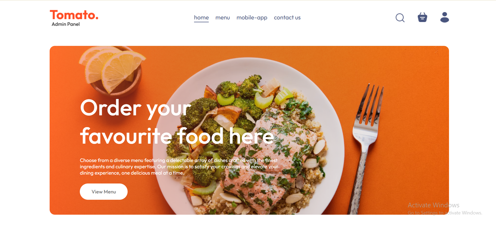 | 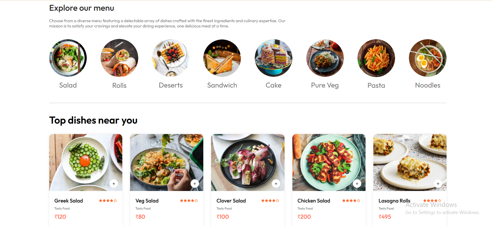 | 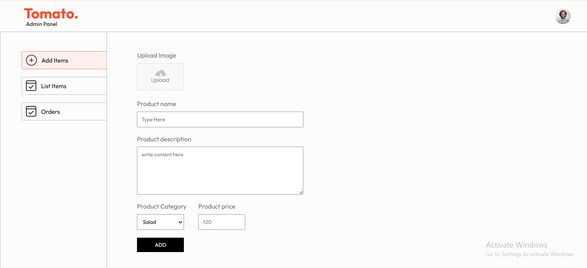 |
| 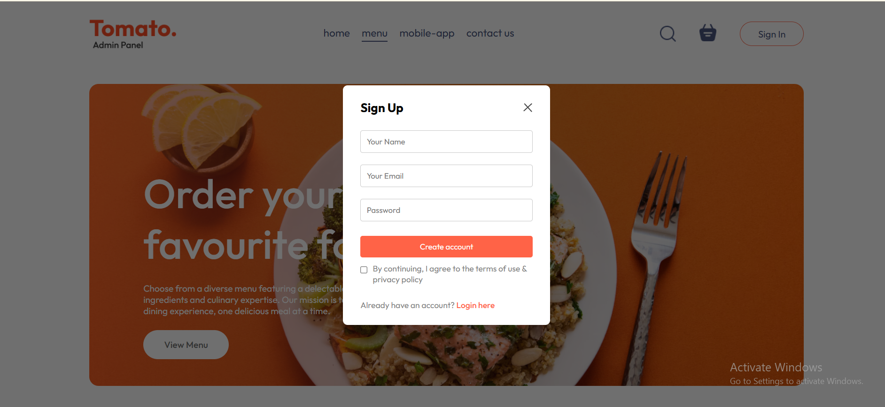 | 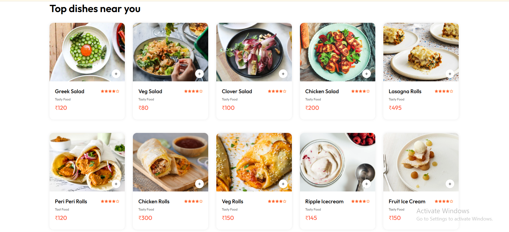 | 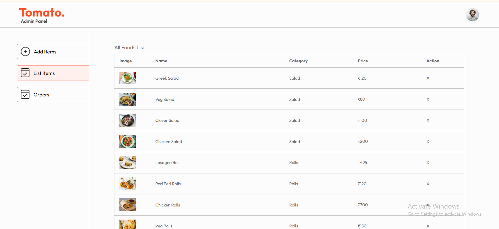 |
| 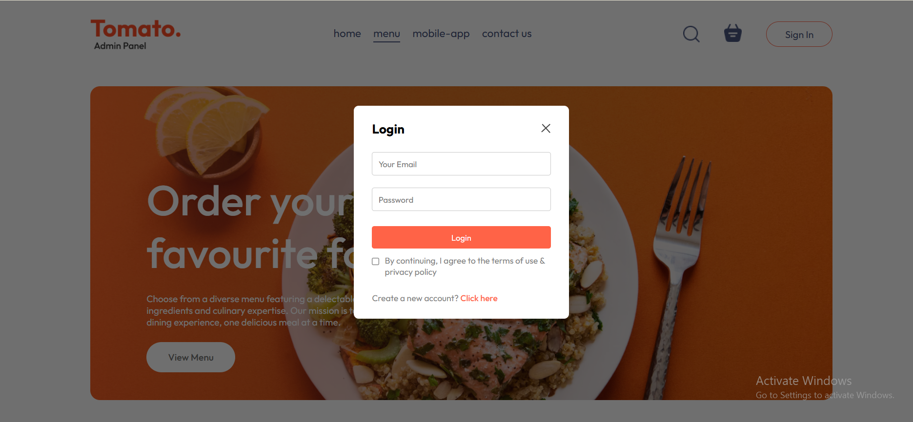 | 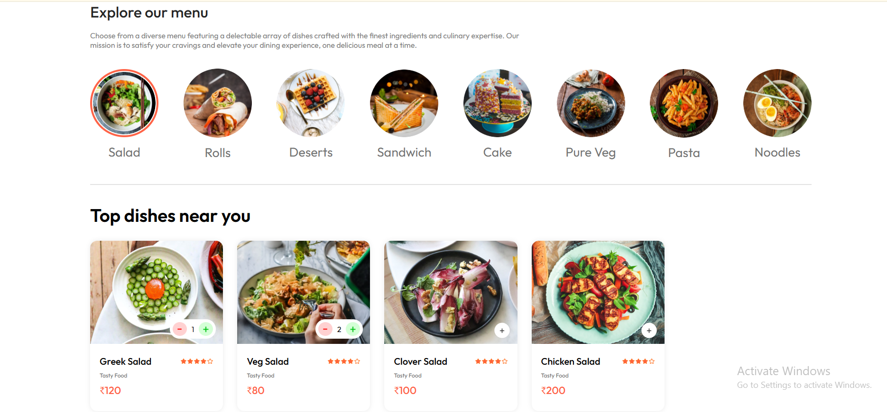 | 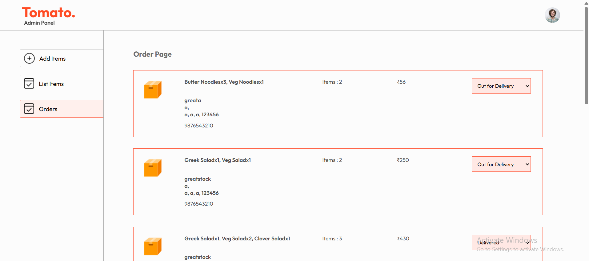 |
| 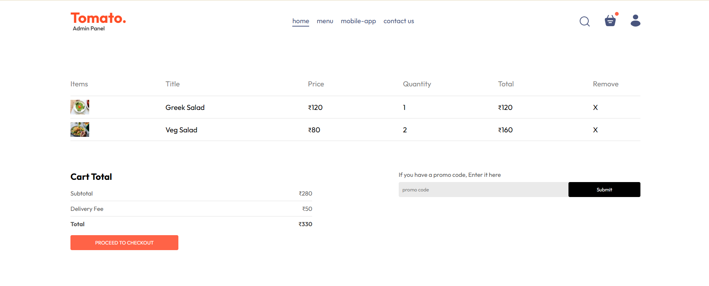 | 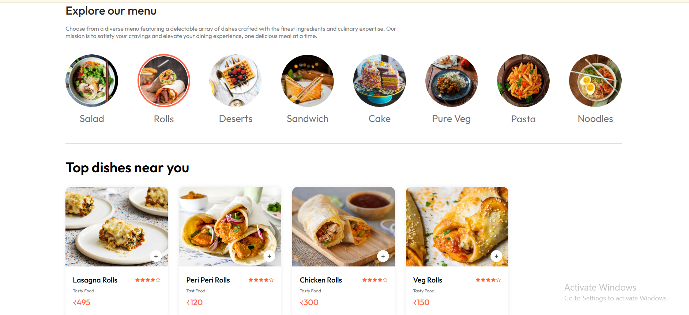 | 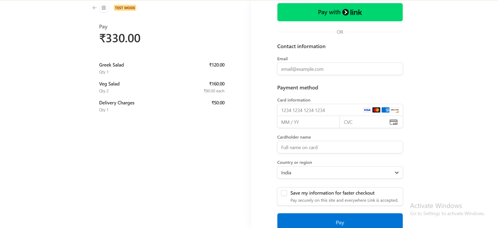 
| 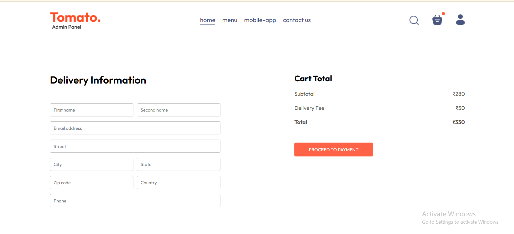 | 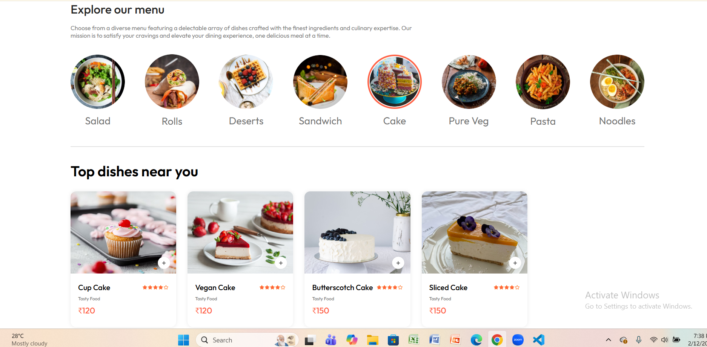 | 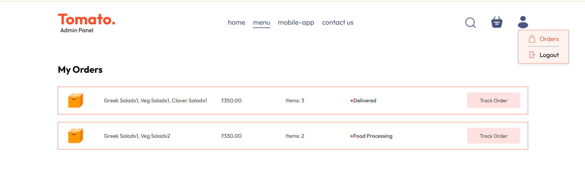 |
| 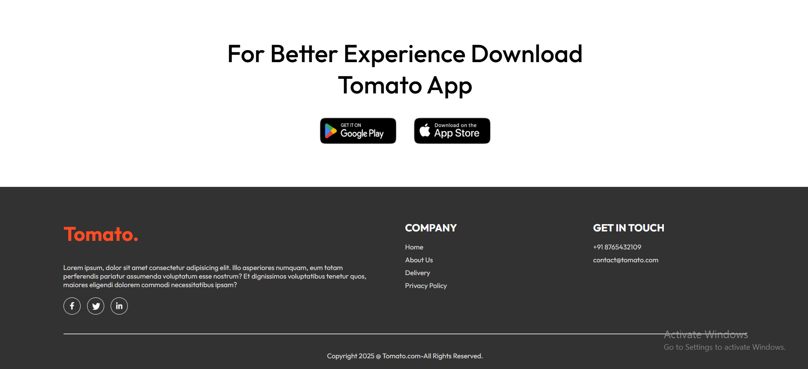 
---

## ✨ Features

- **🛍️ User Side:** - Browse food categories and items.
  - Interactive shopping cart.
  - User authentication (Login/Sign-up).
  - Secure checkout with **Stripe API**.
  - Track order status in real-time.
- **⚙️ Admin Panel:**
  - Add, edit, or remove food items.
  - View and update order statuses.
  - Dashboard overview of sales.

---

## 🛠️ Tech Stack

- **Frontend:** React.js, CSS, Assets
- **Backend:** Node.js, Express.js
- **Database:** MongoDB (Atlas)
- **Payment:** Stripe API

---

## 🚀 Getting Started

### 1. Clone the repository
```bash
git clone [https://github.com/ARCHANA-MADDELA-57/food-del.git](https://github.com/ARCHANA-MADDELA-57/food-del.git)
cd food-del

2. Install Dependencies
Bash

# Install for Backend
cd backend && npm install

# Install for Frontend
cd ../frontend && npm install

# Install for Admin Panel
cd ../admin && npm install

3. Environment Variables
Create a .env file in the backend folder:
Code snippet
MONGODB_URI=your_mongodb_connection_string
STRIPE_SECRET_KEY=your_stripe_key

4. Run the App
Bash

# In backend folder
npm run dev

# In frontend folder
npm start

# In admin folder
npm start


🤝 Contributing
Contributions are welcome! Please fork this repository and submit a pull request for any improvements.